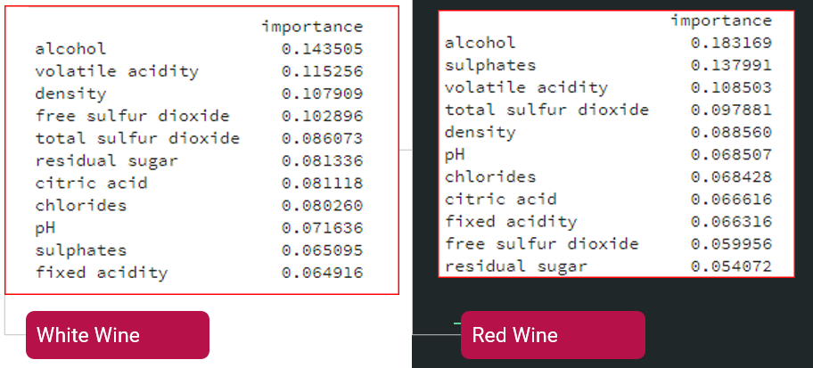
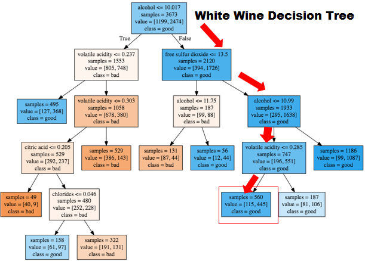

# Wine Classification
Conducted by Elijah Raffo, Jianzhou Li, Xunyi Jiang.

## Overview:
Using python, we developed machine learning models to classify and predict the quality of a wine (up to an 85% accuracy). Then presented on the findings of these models, and how these models impact the industrial wine making process.

## Guide:

Our [dataset](https://github.com/eliraffo/eliraffo.github.io/blob/master/OBA410/Wine_Data.csv) is comprised of data on white and red wine. Columns such as sulfur, residual sugars, etc. can be used to describe the characteristics of the wine. The 'Y' column of the data ranks how good the wine tastes from 1 to 10.

Because our dataset was heavily comprised of 5 and 6 quality ratings we decided to develop a classification model for the wine. Wines 5 and below were considered bad, and wines 6 and above were classified as good. Our [python code](https://github.com/eliraffo/eliraffo.github.io/blob/master/OBA410/Wine_Model.ipynb) tested machine learning models on three groups of data: the complete dataset, a dataset which is only comprised pf white wine, and a dataset which is only comprised of red wine.

A large part of this project was to test different machine learning models, such as K-Nearest Neighbor, Logistic Regression, Linear SVM, SVM, Decision Tree, and Random Forest. Correctly training, testing, and understanding the math behind models is important in assessing accuracy; however, we also tried to understand how these models could affect the industrial wine making process. The best model for creating impact was the decision tree because a company could use additives to adjust a batch of wine to make a bad wine taste good. 

Our [presentation](Wine_Presentation.pdf) and [paper](Wine_Paper.pdf) describe in better detail the findings and methodology of our project. 

