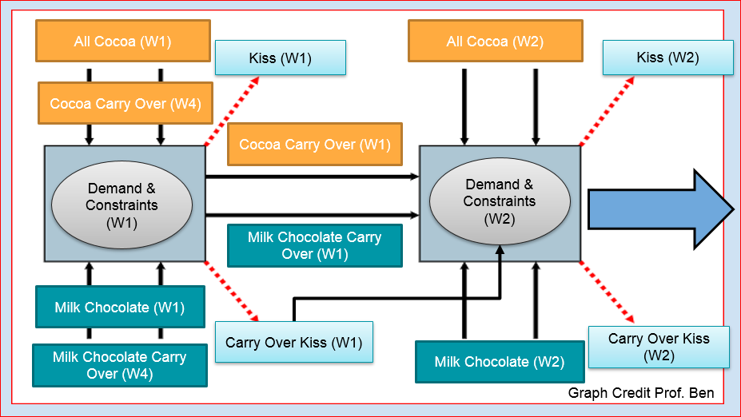
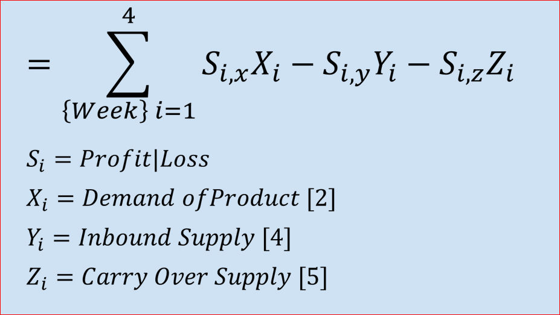

# Hershey's Optimization
Conducted by Alisha Barker, Jake Beder, Taylor Corbalis, Elijah Raffo, and Johnny Whitaker

## Guide
Our projects goal was to optimize the monthly profit of a theoretical Hershey's Kiss and Hug product line. We assumed that the weekly demand and inbound supply fluctuated. We also researched Hershey's to create realistic constraints related to the production process of these two items.

Below is a model we constructed to help visually explain are assumptions for one of the many inbound to production to outbound operational flows that are in the Hershey’s production process.

Visually modeling the decision variables helped build the optimization model. Below is the mathematical model constructed of the optimization equation. Both pictures show one week of modeling; however, our model, equations, and constraints apply to a 4-week rolling inventory and fluctuating demand cycle.

The [complete excel model](https://github.com/eliraffo/eliraffo.github.io/blob/master/OBA466/Hersheys_Solver.xlsx) contains  over 45 decision variables, and accounts for constraints like production capacity, milk supply, cocoa supply, demand constraints, and labor force. Note that the revenue/loss variables used to calculate the profit are complete estimates.

I would recommend reading our [paper](Hersheys_Paper.pdf) and our viewing [presentation](Hersheys_Presentation.pdf) to learn more about how Hershey's can maximize profit by adjusting their production process for Kisses and Hugs. 

[Homepage](eliraffo.github.io).
